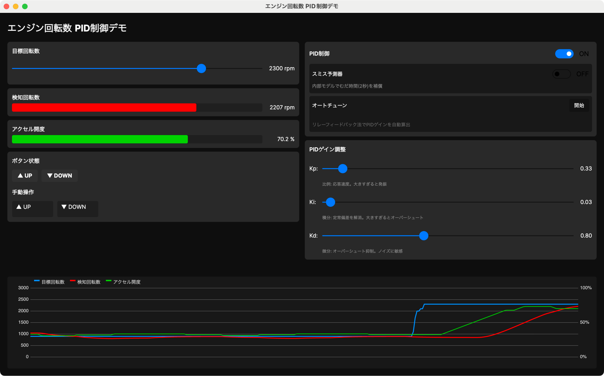

# エンジン回転数 PID制御デモ

エンジンの回転数をPID制御で目標値に追従させるシミュレーションアプリです。
UP/DOWNボタンによるアクセル操作のみで、アクセル開度を知らずに最適な回転数を探索する制御を体験できます。



## 特徴

- **非線形エンジン特性** - 実際のエンジンに近い非線形トルクカーブ（ルックアップテーブル＋線形補間）
- **2秒のセンサー遅延** - むだ時間のある制御の難しさを体感
- **ボタン押下時間ベースの制御** - PID出力を押下時間に変換し、実機のアクチュエータ制約を再現
- **スミス予測器** - 内部モデルでむだ時間を補償するオプション
- **オートチューン** - リレーフィードバック法＋Ziegler-Nichols法によるPIDゲイン自動算出
- **リアルタイムグラフ** - 目標回転数・検知回転数・アクセル開度を時系列表示
- **手動操作** - PID制御中でもボタンで手動介入可能（OR合成）
- **パラメータ保存** - ウィンドウサイズ・位置・PIDゲイン・各種設定を自動保存

## 動作環境

- .NET 8
- Avalonia UI 11

## ビルド・実行

```bash
dotnet run --project PIDControlDemo
```

## 制御の仕組み

### エンジンモデル

| アクセル開度 | 0% | 10% | 20% | 30% | 40% | 50% | 60% | 70% | 80% | 90% | 100% |
|---|---|---|---|---|---|---|---|---|---|---|---|
| 定常回転数(rpm) | 0 | 150 | 400 | 750 | 1150 | 1550 | 1900 | 2200 | 2500 | 2750 | 3000 |

エンジンは一次遅れ系（時定数1秒）で応答し、センサーは2秒の遅延を持ちます。

### PID制御

PIDコントローラは2秒周期で動作し、出力の大きさに応じてUP/DOWNボタンの押下時間（0.1〜10秒）を決定します。アクセル開度は10%/秒で変化します。

### スミス予測器

内部にエンジンモデルを持ち、むだ時間（2秒）の影響を補償します。PIDはむだ時間なしの系を制御しているように振る舞えます。

### オートチューン

リレーフィードバック法で意図的に発振を起こし、発振の周期と振幅からZiegler-Nichols法（ダンピング重視）でPIDゲインを自動算出します。

## プロジェクト構成

```
PIDControlDemo/
├── Models/
│   ├── EngineSimulator.cs    # エンジンシミュレーション（非線形特性＋センサー遅延）
│   ├── ThrottleActuator.cs   # アクセルアクチュエータ（UP/DOWNボタン入力）
│   ├── PidController.cs      # PIDコントローラ（アンチワインドアップ付き）
│   ├── SmithPredictor.cs     # スミス予測器（むだ時間補償）
│   └── RelayAutoTuner.cs     # リレーフィードバック法オートチューナー
├── ViewModels/
│   └── MainWindowViewModel.cs
├── Views/
│   ├── MainWindow.axaml      # 2カラムレイアウト
│   └── MainWindow.axaml.cs
├── Controls/
│   └── RealtimeGraphControl.cs  # カスタム描画グラフ
├── Converters/
│   └── BoolToBrushConverter.cs
└── Services/
    └── WindowSettingsService.cs  # 設定の永続化
```

## ライセンス

MIT
